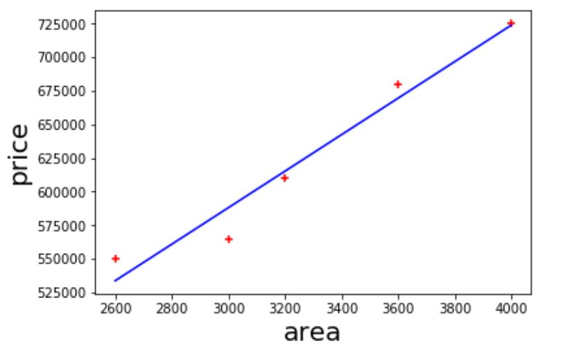
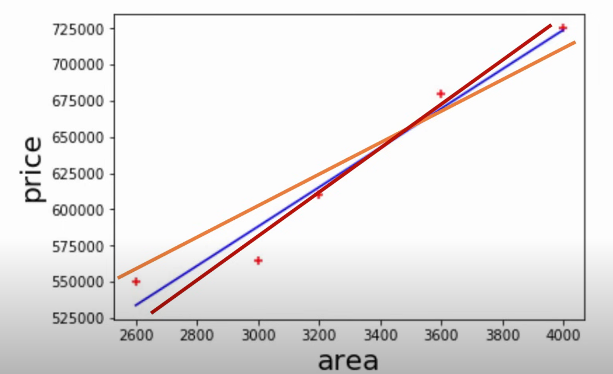
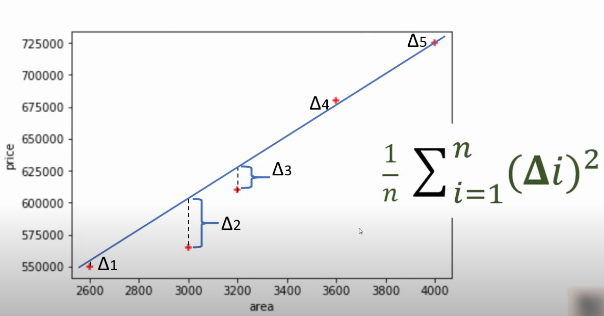
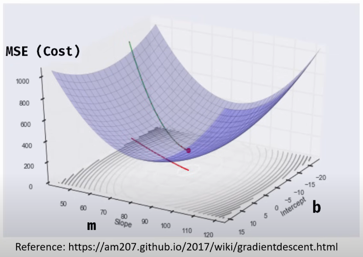
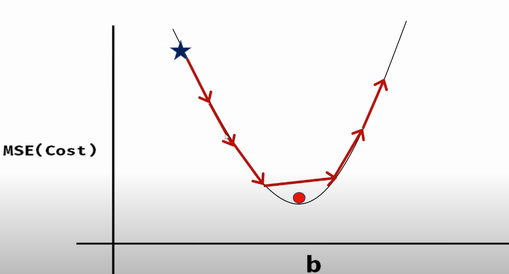
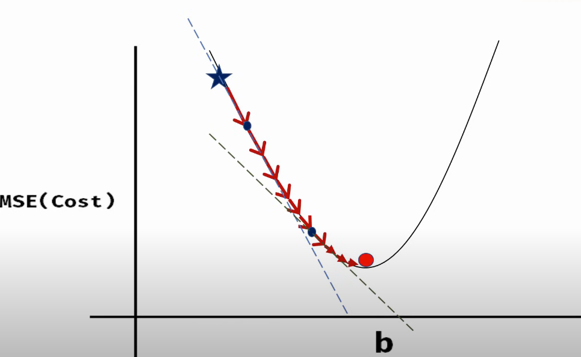

# Gradient Descent And Cost Function
In Maths, we have some equations like, $y = 2x$ and we have a set of **x values** that we use in our equation and get the **y values**.

In Machine Learning, we have **inputs(x values)** and respective **outputs(y values)** in our data set and we need to form a equation that satisfy our dataset, like in [Linear Regression](https://github.com/saad6742988/Machine-Learnig-Basics/blob/main/Simple%20Linear%20Regression/Simple_Linear_Reg.ipynb), we have areas as x values and prices as y values. and we came up with equation,

$$mx +b => 135.79 * x + 180616.44$$

where **135.79 is m** and **180616.44 is b**. This equation gives us the blue line in graph below,

We can have multiple lines as below, if we change m or b values in our equation,

## What is Error(Cost) and Error Calculation?
In machine learning, **Error** refers to the difference between the predicted output of a model and the actual output. It quantifies how well or poorly a model is performing in making predictions

As shown above, we get difference from our actual data point and the point that is predicted by our equation for the same available x values(area in our case), then we square our differences and sum them and then divide it by total number of data points.

$$mse = \frac{1}{n} \sum_{i=1}^{n} (\Delta i)^2$$

This equation is called **Mean Squred Error** and this is most commonly used **Cost Function**. You can say cost is some type of value for how much error we are getting. We can also write it as,

$$\text{mse} = \frac{1}{n} \sum_{i=1}^{n} \left( y_i - y_{\text{predicted}} \right)^2$$

In our case, $y_{\text{predicted}} = mx+b$, so equation becomes,

$$\text{mse} = \frac{1}{n} \sum_{i=1}^{n} \left( y_i - (m*x_i+b) \right)^2$$

## How to choose best line and equation?
**Gradient descent** is an optimization algorithm used to minimize a cost function by iteratively moving towards the minimum value of that function. In the context of machine learning, it's often used to adjust the parameters of a model to minimize the error between the model's predictions and the actual data.

When we use **Mean Squared Error (MSE)** as our cost function, the goal of gradient descent is to find the parameters (in our case **m** and **b**) that minimize the MSE.

Blue space in above is our gradient descent and our goal is to get such values of **m** and **b** where **cost** is lowest. For this, we start with some values of **m** and **b**. In above graph see green line line that start where the cost is more than 1000 and then we change **m** and **bb** in **small steps** and gradually reaches at the point where **cost** is minimal. In abouve graph it is **Red point** in middle.
## About Small Steps
If we take some fixed steps than we may miss our [global minima](https://en.wikipedia.org/wiki/Maximum_and_minimum), like in figure below,

To avoid this situation, we have to modify our step size according to slope at each point with some **learning rate** that will define the rate of change/size of step.

For calculating this slope, we need some calculas and partial derivative. I can't explain this here and also my calculas knowledge is also not good.

>>For understanding, slope using derivative you can go [this page](https://www.mathsisfun.com/calculus/derivatives-introduction.html).

So, we have our base cost function,

$$\text{mse} = \frac{1}{n} \sum_{i=1}^{n} \left( y_i - (m*x_i+b) \right)^2$$

Taking partial derivative with respect to **m** and **b** both,

$$\frac{\partial}{\partial m} = \frac{2}{n} \sum_{i=1}^{n} -x_i \left( y_i - (mx_i + b) \right)$$

And,

$$\frac{\partial}{\partial b} = \frac{2}{n} \sum_{i=1}^{n} -\left( y_i - (mx_i + b) \right)$$

So now, we can get values of **m** and **b** itretively in small steps using below equations,

$$m_{next} = m_{prev} - LearningRate * \frac{\partial}{\partial m}$$

$$b_{next} = b_{prev} - LearningRate * \frac{\partial}{\partial b}$$